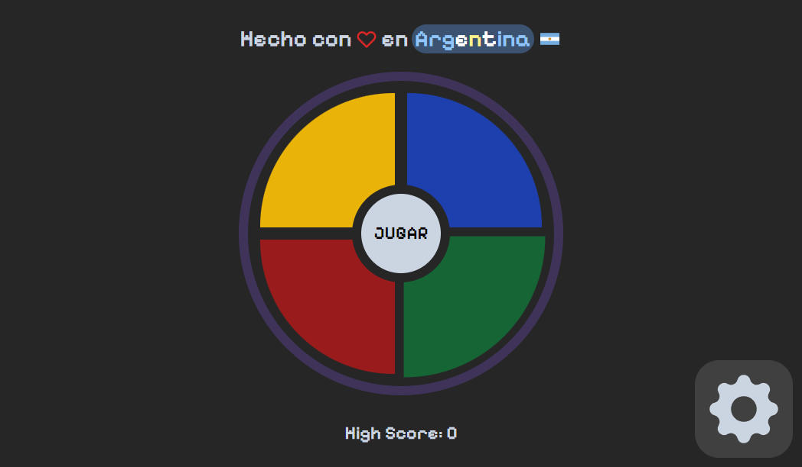

# Juego Simón Dice



## Descripción General

Esta es una versión digital del popular juego de memoria, donde 4 botones se iluminan en una secuencia aleatoria y el usuario debe replicar el orden de la secuencia. Este proyecto fue desarrollado en **React** con la ayuda de **TailwindCSS** para los estilos y **Vite** como herramienta de compilación. La sintaxis utilizada es JSX.

Además de las funcionalidades básicas del juego, el proyecto incluye varias características como diferentes niveles de dificultad y modos de juego, con futuras actualizaciones planificadas.

## Tecnologías Utilizadas

- **React**: Utilizado para el desarrollo de la interfaz y la lógica del juego. Se implementaron hooks como `useState` y `useEffect` para manejar el estado y los efectos secundarios.
- **TailwindCSS**: Para los estilos de los elementos, garantizando un diseño atractivo y responsive.
- **Vite**: Herramienta para la compilación y optimización del proyecto.
- **react-icons**: Paquete usado para añadir iconos de manera rápida y sencilla.
- **react-world-flags**: Utilizado para complementar la interfaz con iconos visuales adicionales.
- **@raddix/use-count-down**: Paquete utilizado para el modo contrarreloj.

## Características Principales

1. **Juego Clásico de Simón Dice**:
   - Los botones se iluminan en una secuencia aleatoria.
   - El jugador debe replicar la secuencia correctamente para avanzar.
2. **Dificultades**:

   - **Fácil**: La secuencia es más corta y el tiempo de respuesta es mayor.
   - **Normal**: Secuencias de longitud moderada con tiempo reducido.
   - **Difícil**: Secuencias más largas y un tiempo de respuesta aún más corto.

3. **Modos de Juego**:

   - **Clásico**: Modo tradicional del juego Simón Dice.
   - **Contrarreloj**: Modo en desarrollo donde el jugador tiene tiempo limitado para completar la secuencia.
   - **Inverso**: Modo en desarrollo donde el jugador debe replicar la secuencia en orden inverso.

4. **Responsive Design**:
   - El diseño es adaptable y funciona bien en dispositivos móviles, tabletas y pantallas de escritorio, ofreciendo una experiencia de usuario fluida en cualquier plataforma.

## Hooks de React Utilizados

- **useState**: Utilizado para manejar el estado del juego, como la secuencia generada, el turno del jugador y la dificultad seleccionada.
- **useEffect**: Utilizado para ejecutar efectos secundarios como la generación de la secuencia aleatoria y la activación de los botones de luz.

## Instalación y Ejecución

1. Clona este repositorio:

   ```bash
   git clone https://github.com/SrChr1s/simon-dice.git
   ```

2. Accede al directorio del proyecto:

   ```bash
   cd simon-dice
   ```

3. Instala las dependencias:

   ```bash
   npm install
   ```

4. Inicia el proyecto en modo desarrollo:

   ```bash
   npm run dev
   ```

   La aplicación estará disponible en `http://localhost:3000`.

## Lista de To-do para Próximas Actualizaciones

- **Colores Personalizables**: Opción para cambiar el color de los botones.
- **Tema Oscuro-Claro**: Implementación de un modo oscuro y claro.
- **Sonidos**: Añadir efectos de sonido cuando los botones se presionan.
- **Selección de Sonidos**: Opción para cambiar qué sonidos se reproducen al pulsar los botones.
