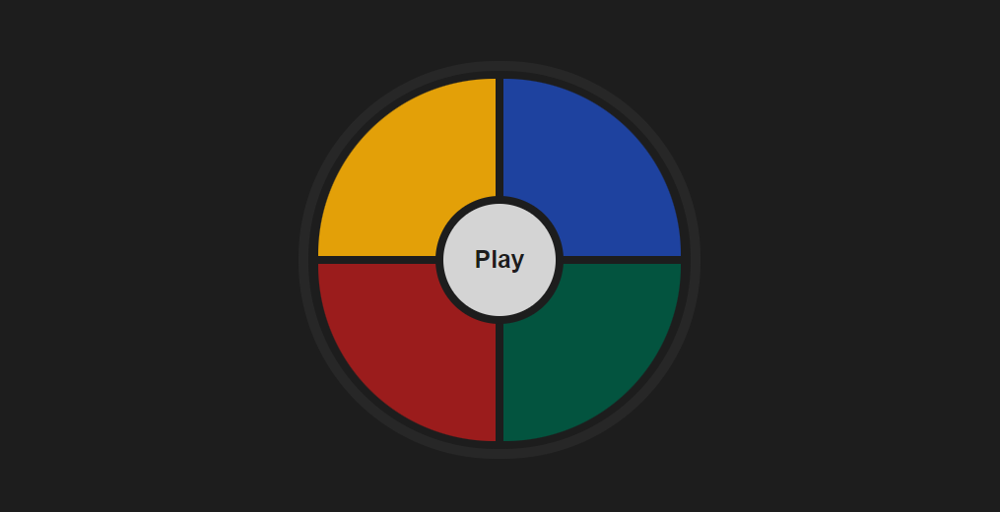

# Simon Dice - Juego en React



## Descripción

Simon Dice es una aplicación interactiva basada en el clásico juego de Simon, donde el objetivo es seguir una secuencia de colores que se presenta de forma aleatoria. El juego incrementa la dificultad a medida que el jugador avanza, desafiando su memoria y capacidad de atención. Este proyecto está desarrollado utilizando **React**, **Vite**, **CSS** y **JSX**, y hace uso de hooks de React como `useState` y `useEffect` para gestionar el estado y los efectos secundarios.

## Características

- **Interfaz sencilla**: El juego está centralizado en la pantalla con una interfaz intuitiva y fácil de usar.
- **Control de dificultad**: Un botón de ajustes en la esquina permite al usuario elegir entre tres niveles de dificultad: Fácil, Medio y Difícil.
- **Uso de Hooks de React**: Implementación de `useState` y `useEffect` para el manejo del estado del juego y la actualización de la interfaz.

## Tecnologías

- **React**: Biblioteca de JavaScript para construir interfaces de usuario.
- **Vite**: Herramienta de construcción rápida para desarrollo y optimización de aplicaciones.
- **CSS**: Estilizado de la interfaz del juego.
- **JSX**: Sintaxis de JavaScript para describir la interfaz de usuario.

## Instalación

Para instalar y ejecutar este proyecto en tu máquina local, sigue estos pasos:

1. Clona el repositorio:

   ```bash
   git clone https://github.com/tu-usuario/simon-dice.git

2. Navega al directorio del proyecto:
   ```bash
   cd simon-dice
   
3. Instala las dependencias:
   ```bash
   npm install
   
4. Ejecuta el proyecto en modo desarrollo:
   ```bash
   npm run dev
   
El juego estará disponible en http://localhost:5173 por defecto.

## Uso

1. **Jugar**: Sigue la secuencia de colores que se muestra en el juego. Cada vez que completes una secuencia correctamente, la secuencia se alargará.
   
2. **Ajustes**: Haz clic en el botón de ajustes en la esquina superior derecha para seleccionar el nivel de dificultad: Fácil, Medio o Difícil.
